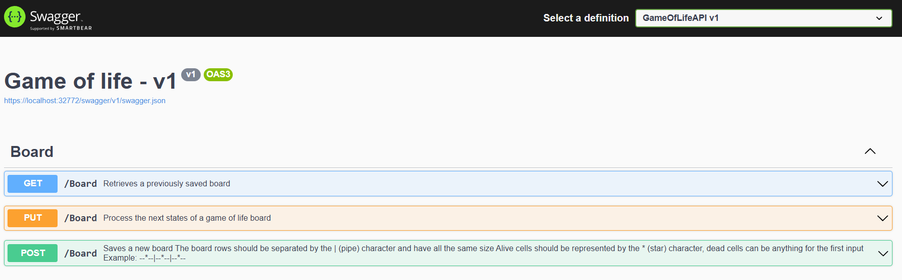

# Game of Life API

Simple API implementation of Conway's game of life ([Conway&#39;s Game of Life - Wikipedia](https://en.wikipedia.org/wiki/Conway%27s_Game_of_Life))

The endpoint address is `/Board` that accepts these 3 http methods:

`GET` Retrieves a previously saved board and accepts the `id` of the board

`POST` Saves a new board, accepts the board in the string format.

_Constraints:_

- All rows in the board should have the same length and be at least 2.
- Alive cells should be represented as a star (*), everything else would be considered a dead cell

`PUT` Process the next state of the board.

- id: board's id
- iterations: How many times the board should be processed for the next state
- finalState: If true, retrieves the board final state. If the final state is not reached after the number of iterations provided, returns a UnprocessableEntity error

## Pre-requisites

This is a code test repository and to run it properly you're going to need a few pre-requisites

1. Docker Desktop
2. Build & Run MongoDB container by running the following commands

```
$> docker pull mongo:latest

$> docker run -d -p 27017:27017 --name test-mongo mongo:latest
```

## Running the solution

- Clone this repository on your local machine
- Open it on Visual Studio
- Be sure that Docker Desktop is up and running
- Be sure that MongoDB container is up and running
- Run the solution and you should see the swagger page for the API:



